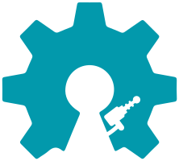
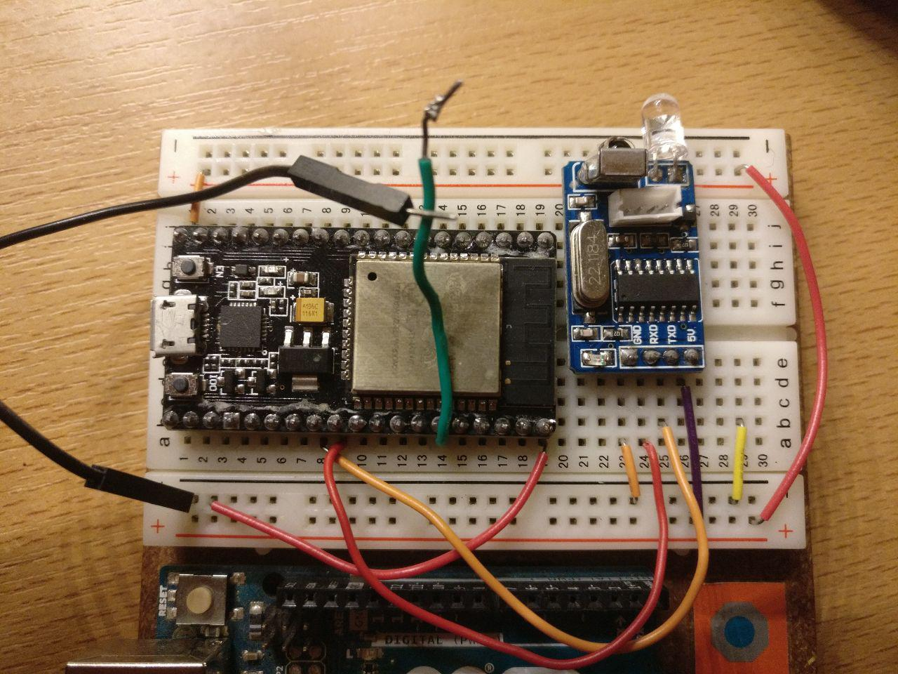

# Open Lasertag
> because Laz00rs!

An cheap and DIY open Source Lasertag build on the ESP-32 and Android. With an simple and expandable achitecture.
After breadboarding or soldering your ESP-32 together with an infraread Modul and glue a lense to it. You install the app on your phone and join a Free for all with all your friends.

Of course you can get as fancy as you want, 3D-printing your own case, enhancing the Tagger with LEDs...

This Project consists of thre parts:
* ESP-32 Firmware (https://github.com/open-lt/tagger-firmware)
* Android App (https://github.com/open-lt/android-app)
* node.js Server (https://github.com/open-lt/server)

## Get Playing
> getting starte_d is kind of a fiddely thing right now as you need to do an Android Build yourself.
> Running the Server is optional as it dosn't do mutch at the current State.

1. Build and install the Android APP.
2. You need a ESP-32 and an IR Module wired like this:

1. A computer with Arduino IDE configured to flash your ESP-32 see how to do this here (https://github.com/espressif/arduino-esp32/)
1. clone the tagger firmware repository (https://github.com/open-lt/tagger-firmware)
1. open it in your arduino IDE
1. flash it to your tagger

After that you shoud be able to shoot at another Tagger thats paired with another phone and it should make a sound.

## Developing

See the docs of the individual repos for app, tagger and server.

## Features

* shoot someone (with real pew pew sound)
* get hit (with sound notification)

## Request for assistance
Idears are piling up. Come joine the forces!
Together we could continue the work with things like:
- make getting startet easier
- 3D-Model for casing
- IOS version
- different play modes (Team Death Match; Capture The Flag; Capture The Hill)
- multiple hit zones
- Weapon Types
- A Class System 
- decentralized app commuinication
- implementing compatibilty modes to other LaserTag Systems

Don't hesitate to send pull request or contact us if you want to get involved.

## Licensing

This project is licensed under the terms of the GPL-3.0.